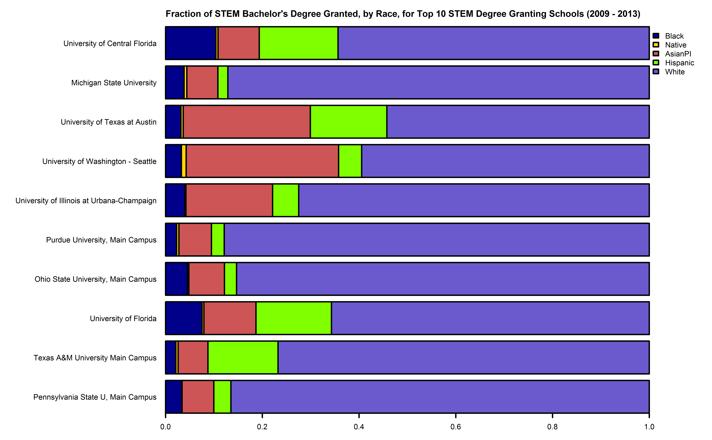

---
output: html_document
---

#Exploring STEM pipelines for underrepresented groups
Code and data for Data Incubator Challenge Questions 4/2015

##Background
The "Let Everyone Dream" campaign, recently announced at the White House Science Fair, is a 90 million (USD) multi-sector initiative to expand STEM opportunities; with a special focus on underrepresented student demographics. This initiative includes^1^:

* A $4 million commitment by Televisa, a Mexican media company, for a national television campaign improving the visibility of Latinas in STEM fields.
* A $15 million commitment by 3M corporation to fund STEM programs for women and underserved population.
* A $4 million commitment by the Motorola Solutions Foundation for innovative hands-on STEM programming for underserved students.

The push for STEM opportunities is not limited to  increasing the number of underrepresented students who choose a STEM career path. Intel recently announced a $300 million initiative^2^ to have full representation of women and minorities in the technology workforce by 2020. This funding will be used to:
* Fund programs to teach STEM to young people in underserved areas.
* Collaborate with higher education institutions.
* Invest in women and minority-owned companies.
* Create hiring and retention incentives and programs to encourage diversity within Intel.
* Collaborate with other tech companies and build out the pipeline for women and minorities into STEM careers.

##Proposal
While greater media representation, and programs to increase participation in STEM projects, will serve to improve underrepresented groups interest in pursuing a STEM career the need remains to build bridges between:
* Secondary school students underrepresented in STEM fields and undergraduate institutions
* Underrepresented undergraduate students and STEM companies or graduate programs

The proposed data analysis project would explore:

* The number of STEM degrees granted at each university in the US.

* The demographic breakdown of STEM bachelors granted for each university.

* The demographic breakdown of graduating seniors in some geographic area surrounding each university.

The goal of this analysis is to identify universities that grant a large number of STEM bachelor degrees, have access to large populations of underrepresented groups in their local primary and secondary schools, and show a direct disparity between the demographics of these schools and the demographics of the post-secondary STEM degrees they are granting. These universities could then be directly targeted for funding opportunities to build a pipeline of diverse students through outreach programs, research opportunities and greater university involvement with their local schools.  

##Data
University STEM degree data was taken from *IPEDS Completions Survey by Race* using the NSF National Center for Science and Engineering Statistics (NCSES) WebCaspar table generator.  The raw data can be found in the Degree_Data_By_Race.csv file. 
The following data fields were selected:
* Year (2009 - 2013)
* Academic Institution Name
* FICE number
* Institution location city
* Institution location state
* Gender
* Race/Ethnicity (standardized)
  + Black
  + Hispanic 
  + Asian or Pacific Islander
  + American Indian or Alaskan Native)
8. Academic Discipline Broad (standardized)
  + Math and Computer Sciences
  + Life Sciences
  + Physical Sciences
  + Science and Engineering Technologies
  + Engineering
  + Geosciences
9. Level of Degree or Other Award
  + Bachelor's Degrees
  + Master's Degrees
  + Associate's Degrees
  + Post-Masters Certificates
  + Doctorate Degree-Professional Practice
  + Doctorate Degree-Research/Scholarship
  + 1 But Less Than 2 Year Certificates
  + Less Than 1 Year Certificates
  + Doctorate Degrees
  + 2 But Less Than 4 Year Certificates
  + Doctorate Degree-Other
  + First Professional Degrees
  + First Professional Certificates (Post-Degree)
9. Sum of Degree Awards Conferred by Race (NSF population of institutions)
10. Institution Zip Code

Secondary school student demographic data was collected from the US Census *American Community Survey, 2009-2013, 5 Year Summary File* using the US Census Data Ferret Interface. Raw data can be found in the High_Schoolers_by_county_Race_data.csv file.
The following data fields were selected:
* County
* State
* B14007I_016E - Hispanic Students Enrolled in Grade 12
* B14007H_016E - White (Alone) Students Enrolled in Grade 12
* B14007B_016E - Black of African American (Alone) Students Enrolled in Grade 12
* B14007C_016E - American Indian or Alaskan Native (Alone) Students Enrolled in Grade 12
* B14007D_016E - Asian (Alone) Students Enrolled in Grade 12
* B14007E_016E - Native Hawaiian and Other Pacific Islander (Alone) Enrolled in Grade 12

Zip code data, which allowed correlation between university zip codes and the surrounding counties was accessed directly from the US Postal Service zip code database (http://www.unitedstateszipcodes.org/zip_code_database.csv) 

###Exploratory Analysis
For initial exploratory analysis the university degree data was limited to Bachelor's degrees and aggregated over all years and majors. The number of aggregate STEM degrees granted, in total and by race, was then calculated for each university.  Zip codes were used to determine each university's county^3^ and an identifier of id = "County, State" was created for each school. The universities were then sorted by the total number of STEM degrees granted over the 2009-2013 time period, *Final_Degree_University_Table.csv*. 
The race demographics for 12th grades by county was aggregated over all years and the number of 12th graders, in total and by race was calculated for each county. An id = "County, State" identifier was added to allow correlation between the two tables. 

The fraction of STEM degrees granted, by race, was then plotted for the ten schools which granted the largest number of STEM degrees overall.   
  
Using the id = "County, State" values the racial demographics for 12th graders in the county of each of the top ten schools was also plotted.

